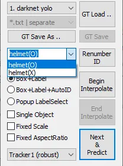

# Nvidia AI Specialist Certification

---

## **Title: Confirmation of wearing or not wearing a helmet at work site in the work place**

---

## Overview of the Project

- **Opening background information**

Many apartments, people, friends, and the people who built the houses I live in in Korea are thanks to the daily workers who work in labor and construction sites. Thanks to the infrastructure that construction workers sweat and have worked with their hands, we (Korea) are living in a convenient place 365 days a year. To prevent accidents caused by not wearing helmets during workers' work, it helps prevent accidents by detecting helmets or not wearing them in real time.

- **General Description of the Current Project**

The project utilizes (Yolov5) to detect helmet wearing and not wearing by construction site workers in real time, inform them of not wearing them, and help reduce the probability of accidents.

- **Proposed Idea for enhancements to the project**

1. Real-time processing: Real-time detection with Yolov5

2. Stability: Can distinguish between non-helmet wearers and wearers in real time to prevent this and reduce accidents

- **Value and significance of this project**

[https://i.namu.wiki/i/RaVqvlgicLbAwlxUnbtQLqCipcEVNuLp4mutPLocYhQTrU_YyUEeGfDX7DMkD_aI_3OgdLCksqX9S-AJnW_HiA.mp4](https://i.namu.wiki/i/RaVqvlgicLbAwlxUnbtQLqCipcEVNuLp4mutPLocYhQTrU_YyUEeGfDX7DMkD_aI_3OgdLCksqX9S-AJnW_HiA.mp4)

[https://i.namu.wiki/i/P-GqiVDiQB4jjLZoMSkHVcI6O9C3oMam86HNbmI_xhlYSdgViA8v56bbsYtR6hkOLAC0R3yIOptZqf6dhsnDmg.mp4](https://i.namu.wiki/i/P-GqiVDiQB4jjLZoMSkHVcI6O9C3oMam86HNbmI_xhlYSdgViA8v56bbsYtR6hkOLAC0R3yIOptZqf6dhsnDmg.mp4)

There are various accidents at the labor site, but there are many accidents that occur due to not wearing a helmet. In fact, there are many accidents that would not have occurred if a helmet was worn. (**Video that tells you the risk of not wearing a helmet)**Through this project, this project will reduce the helmet of workers, and the possibility of accidents will also reduce the possibility of accidents.This can be applied to the future, and it seems that there is also possible to apply in future**.**

- **Current limitations**

Although it is possible to distinguish between not wearing a helmet and wearing it, it is necessary to improve the performance of distinguishing between not wearing a helmet and wearing a hat or something on the head

- **Literature review**

Learning diverse training data and AI for helmets: accurate image recognition, accurate understanding of guest house detection and classification

---

## **Image Acquisition Method:**

- **I got the video from YouTube because I can't actually go into the labor field and film it**

[https://drive.google.com/drive/folders/1TTbMUXGdHJemgqlmActXrOkjXf1iSfc2?usp=sharing](https://drive.google.com/drive/folders/1TTbMUXGdHJemgqlmActXrOkjXf1iSfc2?usp=sharing)

## **Learning data extraction and Learning annotation:**

**To learn from Yolov5 to 640 resolution images, the image is made into 640 x 640.**

### Video resolution adjustment

[비디오 리사이저 - 온라인에서 무료로 비디오 해상도 변경](https://online-video-cutter.com/ko/resize-video)


**Image conversion is performed on a frame-by-frame basis using the DarkLabel program.**


(DarkLabel Launch Screen)


**First, I add the classes I will write through the darklabel.yml file before annobrating the video.**


**Make my_classes2 in the yaml file and add helmet(O) and helmet(X) as class names that can distinguish between wearing and not wearing helmets.**


**Now, add "my_classes2" to see the class set in the DarkLabel GUI when announcing, and set the name to "darknet yolo”**


**It can be seen that two classes set separately from the classes "darknet yolo" have been added.**



**After finishing labeling in DarkLabel, press the "as Images" button to select an image folder to save the converted image. Then, press the "GT Save As" button to create a separate label storage folder and store it in the folde**


**Now you can see that there are separate labels and converted txt files and image files in the image folder.**


---

# Nvidia Jetson Nano Training Process

**Enter Google Drive and Install Google Collaboration for Image Learning**


**Run Colab and enter the code that connects to the Google drive in the command window prompt.**

```python
# prompt: 구글 드라이브랑 연결

from google.colab import drive
drive.flush_and_unmount()  # 기존 마운트 해제
drive.mount('/content/drive')  # 다시 마운트

%cd /content/drive/MyDrive

%pwd
```

### Yolov5

**Access yolov5 on Google Drive, download it, and install all the necessary libraries in bulk using the Requirements.txt file.**

```python
# 기존에 설치를 완료한 경우에는 해당 경로로 이동만 하면 됩니다.
%cd /content/drive/MyDrive/yolov5

##
#clone YOLOv5 and
!git clone https://github.com/ultralytics/yolov5  # clone repo
%cd yolov5
%pip install -qr requirements.txt # install dependencies

!pip install Pillow==10.3
```

**After run the code "!pip install Pillow==10.3" and run again that connects to the Google drive in the command window prompt**

**A folder called yolov5 is created and contains gitclone files in it.**


### **Managing Image and Label Files**

**Enter the folder creation code for managing image and label files.**

```python
!mkdir -p Train/labels
!mkdir -p Train/images
!mkdir -p Val/labels
!mkdir -p Val/images
```

**Train and Val folders that may manage image and label files are created in the previously created yolov5 folder, and the converted image and label generated by Darklabel are uploaded to the image and label folder of the Train folder.**


**After that, put the [yolov5n.pt](http://yolov5n.pt/) file that came with the guide in the yolov5 folder and the data.yaml file that you modified to match the name of the class you labeled.**


```python
##검증 데이터 만들기
import os
import shutil
from sklearn.model_selection import train_test_split

def create_validation_set(train_path, val_path, split_ratio=0.3):
    """
    Train 데이터의 일부를 Val로 이동
    """
    # 필요한 디렉토리 생성
    os.makedirs(os.path.join(val_path, 'images'), exist_ok=True)
    os.makedirs(os.path.join(val_path, 'labels'), exist_ok=True)

    # Train 이미지 리스트 가져오기
    train_images = os.listdir(os.path.join(train_path, 'images'))
    train_images = [f for f in train_images if f.endswith(('.jpg', '.jpeg', '.png'))]

    # Train/Val 분할
    _, val_images = train_test_split(train_images,
                                   test_size=split_ratio,
                                   random_state=42)

    # Val로 파일 복사
    for image_file in val_images:
        # 이미지 복사
        src_image = os.path.join(train_path, 'images', image_file)
        dst_image = os.path.join(val_path, 'images', image_file)
        shutil.copy2(src_image, dst_image)

        # 라벨 파일 복사
        label_file = os.path.splitext(image_file)[0] + '.txt'
        src_label = os.path.join(train_path, 'labels', label_file)
        dst_label = os.path.join(val_path, 'labels', label_file)
        if os.path.exists(src_label):
            shutil.copy2(src_label, dst_label)

    print(f"Created validation set with {len(val_images)} images")

# 실행
train_path = '/content/drive/MyDrive/yolov5/yolov5/Train'
val_path = '/content/drive/MyDrive/yolov5/yolov5/Val'

create_validation_set(train_path, val_path)
```

```python
def check_dataset():
    train_path = '/content/drive/MyDrive/yolov5/yolov5/Train'
    val_path = '/content/drive/MyDrive/yolov5/yolov5/Val'

    # Train 데이터 확인
    train_images = len(os.listdir(os.path.join(train_path, 'images')))
    train_labels = len(os.listdir(os.path.join(train_path, 'labels')))

    # Val 데이터 확인
    val_images = len(os.listdir(os.path.join(val_path, 'images')))
    val_labels = len(os.listdir(os.path.join(val_path, 'labels')))

    print("Dataset status:")
    print(f"Train - Images: {train_images}, Labels: {train_labels}")
    print(f"Val - Images: {val_images}, Labels: {val_labels}")

# 데이터셋 상태 확인
check_dataset()
```

### Start of yolov5 model training

**Enter the code to import the required library to start learning the model.**

```python
#필요 라이브러리 임포트하기
import torch
import os
from IPython.display import Image, clear_output  # to display images
```

```python
%pwd
```

```python
import numpy as np
import tensorflow as tf
import os
from PIL import Image
from tensorflow.python.eager.context import eager_mode

def _preproc(image, output_height=512, output_width=512, resize_side=512):
    ''' imagenet-standard: aspect-preserving resize to 256px smaller-side, then central-crop to 224px'''
    with eager_mode():
        h, w = image.shape[0], image.shape[1]
        scale = tf.cond(tf.less(h, w), lambda: resize_side / h, lambda: resize_side / w)
        resized_image = tf.compat.v1.image.resize_bilinear(tf.expand_dims(image, 0), [int(h*scale), int(w*scale)])
        cropped_image = tf.compat.v1.image.resize_with_crop_or_pad(resized_image, output_height, output_width)
        return tf.squeeze(cropped_image)

def Create_npy(imagespath, imgsize, ext) :
    images_list = [img_name for img_name in os.listdir(imagespath) if
                os.path.splitext(img_name)[1].lower() == '.'+ext.lower()]
    calib_dataset = np.zeros((len(images_list), imgsize, imgsize, 3), dtype=np.float32)

    for idx, img_name in enumerate(sorted(images_list)):
        img_path = os.path.join(imagespath, img_name)
        try:
            # 파일 크기가 정상적인지 확인
            if os.path.getsize(img_path) == 0:
                print(f"Error: {img_path} is empty.")
                continue

            img = Image.open(img_path)
            img = img.convert("RGB")  # RGBA 이미지 등 다른 형식이 있을 경우 강제로 RGB로 변환
            img_np = np.array(img)

            img_preproc = _preproc(img_np, imgsize, imgsize, imgsize)
            calib_dataset[idx,:,:,:] = img_preproc.numpy().astype(np.uint8)
            print(f"Processed image {img_path}")

        except Exception as e:
            print(f"Error processing image {img_path}: {e}")

    np.save('calib_set.npy', calib_dataset)
```

```python
# "cannot identify image file" 에러가 발생하는 경우, PILLOW Version을 "!pip install Pillow==10.1" 로 변경하여 설치합니다.
Create_npy('/content/drive/MyDrive/yolov5/yolov5/Train/images', 512, 'jpg')
```

**After inputting the above codes sequentially, inputting an instruction code to learn the labeled photos, and then waiting.**

```python
#모델 학습하기
!python train.py  --img 640 --batch 16 --epochs 300 --data /content/drive/MyDrive/yolov5/yolov5/data.yaml --weights yolov5n.pt --cache
```

> **img 640 : Set the input image size (640x640)**
> 

> **batch 16 : batch size setting (number of images processed at a time)**
> 

> **epochs 2000: Set the total number of epochs to learn**
> 

> **data /content/drive/MyDrive/yolov5/yolov5/data.yaml: Specify the path to the yaml file that contains settings for the dataset and model configuration (path to the data.yaml file that you uploaded earlier)**
> 


**After the learning is completed, it can be confirmed that the learning has been performed in the runs → train → exp folder in the yolov5 folder.**


**The learning outcomes are as follows.**

[https://drive.google.com/drive/folders/1Pnznlpp3lVJ07zvkF9WLPl-XC5J3x-aC?usp=drive_link](https://drive.google.com/drive/folders/1Pnznlpp3lVJ07zvkF9WLPl-XC5J3x-aC?usp=drive_link)


### F1 Curve


### PR Curve


### P Curve


### R Curve


### Results


### Train batch


**Since it is necessary to check the learning results after learning, there is a weights file in the exp file, of which [best.pt](http://best.pt/) is used to enter a command to check the learning results by going to [detect.py](http://detect.py/)** 

```python
!python detect.py --weights /content/drive/MyDrive/yolov5/yolov5/runs/train/exp/weights/best.pt --img 640 --conf 0.1 --source /content/drive/MyDrive/yolov5/yolov5/Train/images
```

### Run video

**Enter a command to perform the learning result as an image**

```python
!python detect.py --weights /content/drive/MyDrive/yolov5/yolov5/runs/train/exp/weights/best.pt --img 640 --conf 0.1 --source /content/drive/MyDrive/video/video.mp4
```

[2024-12-02 13-49-08.mkv](2024-12-02_13-49-08.mkv)

[https://drive.google.com/drive/folders/1cLVEpnCGNvk38q2oiVM-jbTBL_SsAtTS?usp=sharing](https://drive.google.com/drive/folders/1cLVEpnCGNvk38q2oiVM-jbTBL_SsAtTS?usp=sharing)